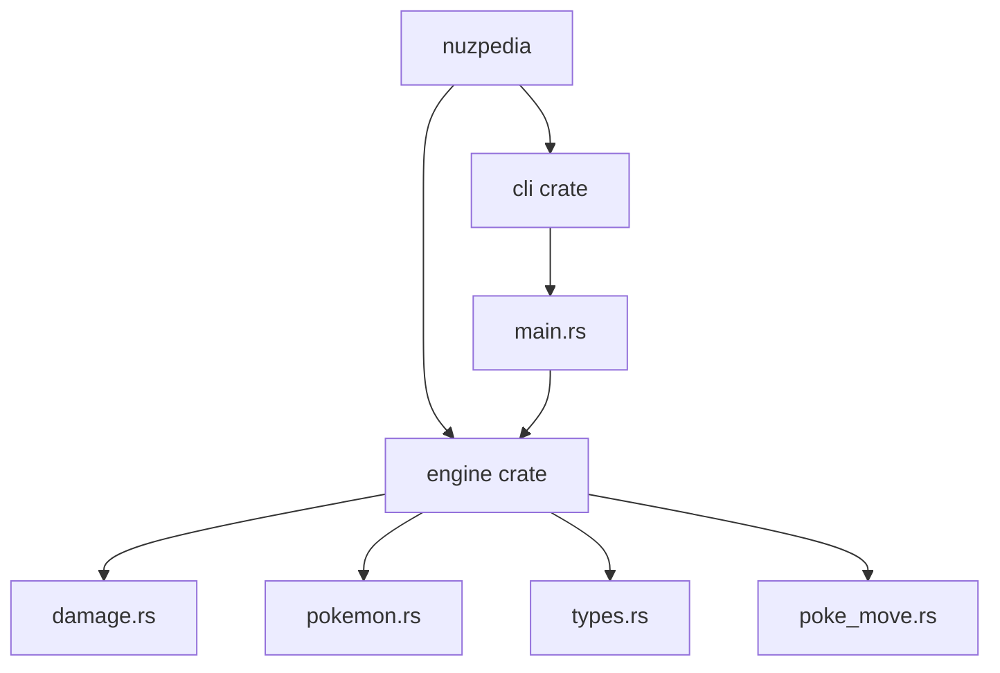
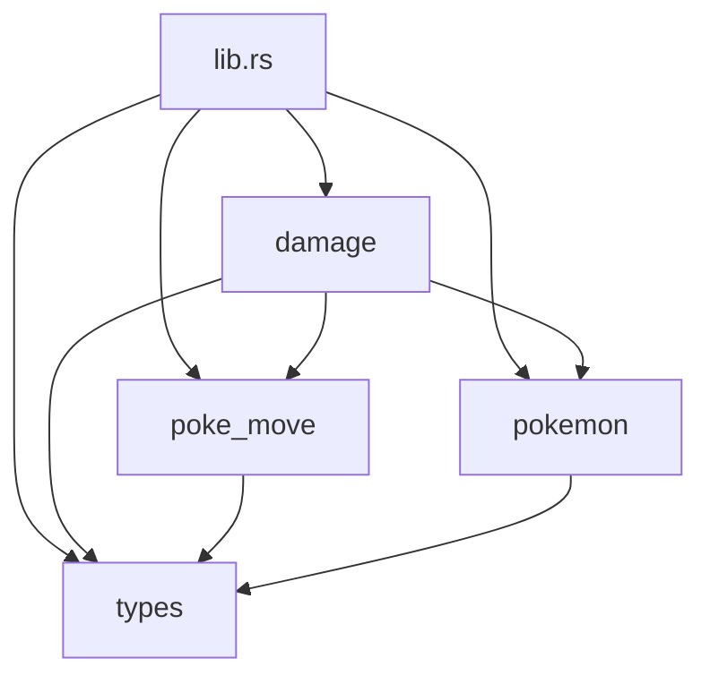
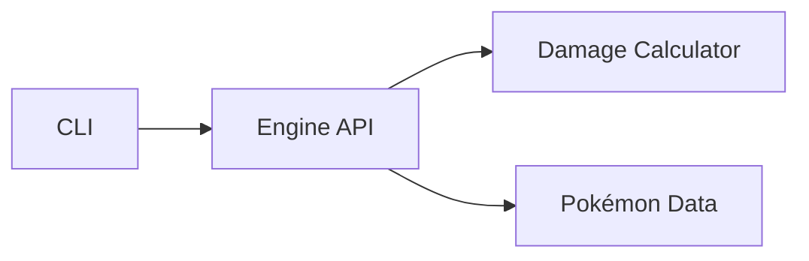

# nuzpedia

nuzpedia is a suite of tools to assist with Pokémon Nuzlocke challenges, starting with a comprehensive damage calculator.

## Current Features

### Generation 1 damage calculator (Partial Implementation)
- Accurate damage calculation formulas
- Type effectiveness multipliers
- STAB (Same-Type Attack Bonus)
- Generation 1-specific critical hit mechanics
- Damage roll options:
    - High/low bounds
    - Average (Mean)
    - Random

## Future Roadmap

### Damage Calculator
- [ ] Complete Generation 1 implementation
- [ ] Extend support through Generation 9

### Planned Modules
- **Team Builder/Planner**
  - Type coverage analysis
  - Move synergy evaluation
  - Encounter location database
- **Nuzlocke Tracker**
  - Route encounter management
  - Death tracking
  - Rule customization
- **Trainer Database**
  - Opponent team previews
  - Move sets and abilities

## Project Structure

This project is organised as a Cargo workspace with two primary crates (more to be added as development progresses):



### Crates Overview

- `engine`: Core calculation logic for Pokemon battles
    - `damage.rs`: Damage calculation formulas
    - `pokemon.rs`: Pokemon data and stats
    - `types.rs`: Type effectiveness and interactions
    - `poke_move.rs`: Move data and effects
- `cli`: Command-line interface for interacting with the engine

### `engine` Architecture



### `cli` Implementation


## Contributing

On the off chance this repo eventually gains some traction/popularity, feel free to contribute!

### Local Development Setup

1. Clone and enter repo:

```bash
git clone git@github.com:calmkoi/nuzpedia.git
cd nuzpedia
```

2. Install Rust (via rustup) if not already installed
3. Build and run

```bash
cargo build
cargo run
```

4. Commit changes
5. Reset workspace (if required)
